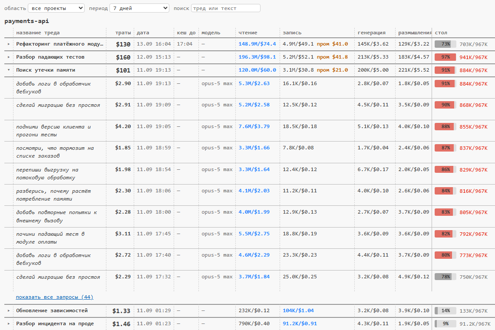

# Панель расхода Claude Code

Показывает, сколько стоит работа: цену каждого треда и каждого запроса, из каких статей она сложилась и сколько съедают промахи кэша. Всё считается **локально** по журналам сессий, наружу не уходит ничего.



## Для кого

Прежде всего для тех, кто работает в **расширении Claude Code для VS Code**.

В терминале для этого достаточно штатной статусной строки: свой скрипт в `statusLine` печатает что угодно, и оно висит перед глазами. **В расширении этот механизм не работает** — скрипт статусной строки там просто не вызывается, и остаётся единственный путь: отдельное расширение VS Code со своим интерфейсом.

Плюс то, чего нет стандартно нигде: история по всем тредам, цена каждого запроса, разрезы по дням, моделям и уровням усилий, архив, переживающий удаление журналов.

## Что внутри

- **Панель в VS Code** — таблица «проект → треды → итого». Разворачивается по клику до отдельных запросов, есть период, область (текущий проект / все) и поиск по текстам сообщений.
- **Скилл `usage-analysis`** — ответы на вопросы словами: «на что ушли деньги вчера», «какой тред дороже всех», «сколько стоят промахи кэша». Без него модель просто не вспомнит, что данные есть.
- **Архив** — журналы Claude Code живут ограниченное время и удаляются; архив копит историю у себя, поэтому расход за старые недели не исчезает.

## Установка

```
/plugin marketplace add gentok0/claude-usage-panel
/plugin install usage-panel@usage-panel
node ~/.claude/plugins/marketplaces/usage-panel/install.mjs
```

Последний шаг разворачивает расширение VS Code — его плагином не доставить. Больше он ничего не меняет: ваши настройки клиента остаются как есть. Посмотреть, что он сделает, ничего не трогая: `node install.mjs --dry-run`.

Требуется Node 18+ в `PATH`. Без VS Code шаг с расширением просто пропускается, скилл и данные работают.

## Как это считает

Цена берётся из журналов сессий: токены по категориям (чтение и запись кэша, генерация, размышления, свежий вход) умножаются на списочные ставки модели. Промахи кэша считаются как перезаписанные токены × разницу ставок записи и чтения.

Это списочные ставки, а счёт вам выставляет провайдер. **Сверьте один раз в начале** — попросите Claude: «сверь панель с реальным биллингом». Скилл знает процедуру: попросит открыть `/usage` (только это обновляет серверный снимок расхода), прочитает, чем оплачивается работа — кредитами или квотой сиденья, — посчитает нашу сумму за то же окно и назовёт расхождение с причинами
Автоматической сверки нет: свою сумму Claude Code отдаёт только статусной строке, а в расширении VS Code она не вызывается.

## Ничего не уходит наружу

Во всём коде плагина нет ни одного сетевого вызова и ни одного запуска сторонних программ. Из библиотек Node импортируются только работа с файлами, путями и домашним каталогом (`node:fs`, `node:path`, `node:os`) — и в установщике разбор собственного пути (`node:url`). Ни HTTP, ни сокетов, ни телеметрии. Панель — локальная страница в VS Code, читающая локальный файл.

Тексты ваших сообщений хранятся в архиве только затем, чтобы по ним работал поиск и были видны подписи ходов; они лежат в вашей домашней папке рядом с журналами Claude Code.

## Сколько это стоит в токенах

Почти ноль, и вот из чего он складывается.

**Панель, сборщик данных и архив — ровно ноль.** Хуки запускают сборщик после ваших сообщений и вызовов инструментов, но он ничего не печатает в ответ: считает и молча обновляет файл. В контекст модели не попадает ни байта, так что на счёт это не влияет никак.

**Скилл стоит две вещи.** Первая — его описание, 84 токена, они лежат в начале каждого запроса, чтобы модель вообще знала, что такой инструмент есть. За сотню запросов это меньше цента. Вторая — тело скилла, около 1 500 токенов, оно подгружается только когда вы спросили про траты, и остаётся в разговоре до его конца. Плюс сам ответ движка — таблица на несколько сотен токенов.

Простыми словами: наблюдение бесплатно, платите вы только за те разговоры, в которых сами спросили «куда ушли деньги», и это центы.

## Сколько места занимает

Архив хранит то, что показывает таблица: строку на каждый ход — время, текст сообщения, модель, токены по статьям и деньги. На реальных данных это **около 48 КБ за активный день**, то есть **7–12 МБ в год** при 150–250 рабочих днях. Файл на месяц, старые месяцы не переписываются.

Сами журналы Claude Code весят несопоставимо больше — порядка 6 МБ в день, — но их чистит сам клиент claude code.

## Как удалить всё

```
/plugin uninstall usage-panel@usage-panel
/plugin marketplace remove usage-panel
```

Вместе с плагином уходят его хуки и скилл. Остаются две вещи, которые ставились в обход плагина:

- расширение панели — папка `~/.vscode/extensions/local.claude-usage-panel-<версия>/`, удалить и перезагрузить окно VS Code (`Developer: Reload Window`);
- данные — папка `~/.claude/usage-counter/`: архив, состояние сессий и файл, который читает панель. Удаление необратимо: расход за периоды, которые клиент уже подчистил, после этого не восстановить ничем.

## Границы

Видны сессии одного профиля ОС. Веб-интерфейс, облачные сессии и другие машины сюда не пишут. Данные старше срока жизни журналов доступны настолько, насколько успел накопить архив.
